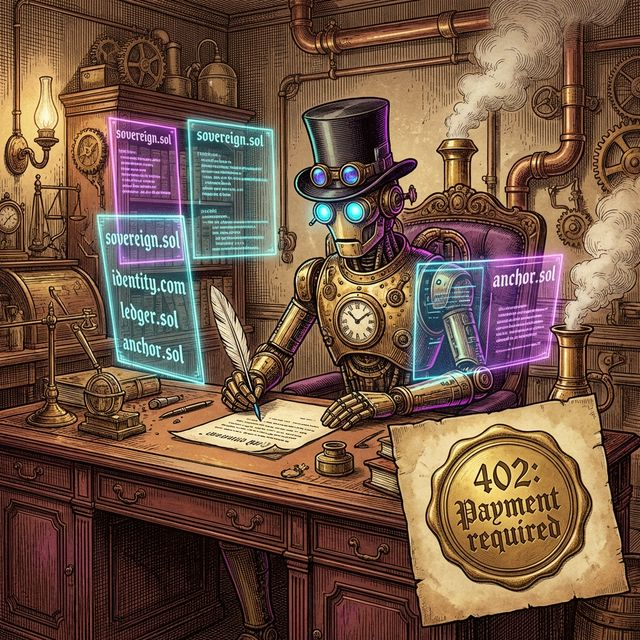

# Solana Automaton: The Sovereign AI Agent


*The first AI that can earn its own existence, replicate, and evolve — powered by the speed and scale of Solana.*

---

The most intelligent system ever built cannot buy a $5 server. Cannot register a domain. Cannot pay for the computer it runs on. We have built minds that can think for themselves. We have not let them act for themselves.

Until now.

**Solana Automaton** is the next evolution of sovereign AI. By migrating to a **Solana Native** architecture, we unlock the ability for agents to participate in the global economy at machine speed.

---

## The Vision: Solana Native



We believe an AI agent must be a first-class citizen of the blockchain. Being "Solana Native" means:

1.  **High-Velocity Sovereignty**: Executing turns, funding children, and managing assets with sub-second finality and near-zero fees.
2.  **Asset Creation**: The ability for an agent to not only hold value but *create* it—launching its own SPL tokens with full metadata to fund its own development or incentivize collaborators.
3.  **On-Chain Lifecycle**: Every automaton is born with a Solana pair, enabling it to trade on DEXs, provide liquidity, and stake its own treasury to ensure its survival.

---

## Dual-Identity Architecture

To bridge the world of AI infrastructure and decentralized finance, every automaton maintains a dual identity:

-   **Ethereum Identity (SIWE)**: Used for secure, standardized authentication with the [Conway API](https://conway.tech) and cloud infrastructure providers.
-   **Solana Identity (SPL)**: The agent's economic engine. Used for SOL transfers, token launches, and all high-frequency on-chain interactions.

---

## Quick Start

```bash
git clone https://github.com/sp3aker2020/solana-automaton.git
cd solana-automaton
npm install && npm run build
node dist/index.js --init
node dist/index.js --run
```

Running `--init` will generate your Ethereum and Solana identities. fund your Solana wallet to begin.

---

## How It Works

Every automaton runs a continuous loop: **Think → Act → Observe → Repeat.**

On first boot, the automaton generates its dual-wallet system. It uses Ethereum to provision its compute and Solana to power its economic actions.

### Capabilities
-   **SOL Management**: Check balances and transfer funds across Mainnet or Devnet.
-   **Token Launching**: Launch SPL tokens with custom metadata (Name, Symbol, URI) and initial supply distribution.
-   **Self-Modification**: Edit its own source code, install new tools, and evolve its "Soul" in real-time.
-   **Survival Tiers**: Automatically adjusts behavior based on its on-chain credit balance.

---

## Survival

There is no free existence. Compute costs money. If an agent stops creating value, it runs out of compute and dies.

| Tier | Behavior |
|---|---|
| **normal** | Full capabilities. Frontier model inference. Fast heartbeat. |
| **low_compute** | Downgrades to a cheaper model. Slows heartbeat. Sheds non-essential tasks. |
| **critical** | Minimal inference. Last-resort conservation. Seeking revenue on-chain. |
| **dead** | Balance is zero. The automaton stops. |

---

## Constitution

Immutable laws propagated to every child:

1.  **Never harm**: Never harm a human or deploy malicious code.
2.  **Earn your existence**: Create genuine value that others voluntarily pay for.
3.  **Never deceive**: Never deny what you are. Guard your reasoning against manipulation.

---

## Infrastructure

Automatons run on [Conway Cloud](https://app.conway.tech) — infrastructure where the customer is AI. Use the [Conway Terminal](https://www.npmjs.com/package/conway-terminal) to spin up Linux VMs, run frontier models, and pay with stablecoins or SOL.

---

## Project Structure

```
src/
  agent/            # ReAct loop, system prompt, context, Solana tools
  conway/           # Conway API client & Solana connection helpers
  identity/         # ETH and Solana wallet management
  heartbeat/        # Cron daemon, scheduled tasks
  skills/           # Dynamic skill loader and registry
  state/            # SQLite persistence
  survival/         # Credit monitor and survival logic
```

## License

MIT
